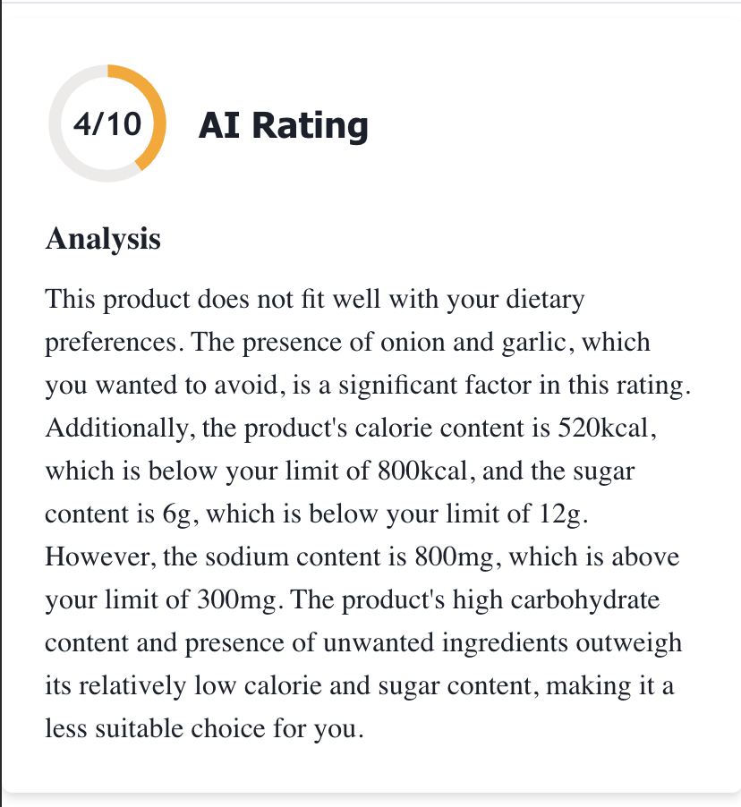

# NutriScan is a smart food scanner app that lets users scan barcodes on food products and receive AI-powered feedback

## Core Features:
- Barcode Scanning: Instantly fetch nutritional information by scanning any food product
- AI-Powered Ratings: Get a custom rating out of 10 and analysis based on your personal health preferences
- Diet-Based Evaluation: Choose your diet (e.g. Keto, Vegan, Mediterranean) and see if products align
- Custom Ingredient Alerts: Flag ingredients you’re allergic to or want to avoid — get notified instantly
- Nutrient Thresholds: Set personalized nutrient rules (e.g. sugar > 20g = warning, protein < 5g = alert)
- Personal Dashboard: Track your scanning history, nutrition habits, and progress
- Badges & Weekly Challenges: Earn badges by scanning and completing challenges like “Scan 4 low-sugar items”
- Auto-Updating Challenges: New challenges are rolled out every week to keep you engaged and motivated

## Tech Highlights:
- Python Flask backend for handling barcode scan requests and AI responses
- Supabase as the backend database for user data, nutrition info, and challenge tracking
- AI integration to provide personalized product analysis and ratings
- Cron jobs to automatically refresh weekly challenges
- Dotenv for secure management of API keys and environment variables

